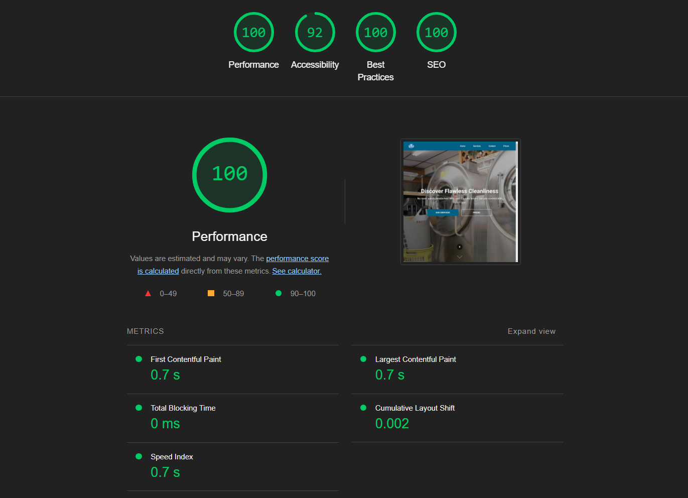

# Worcester Laundry

A responsive landing page for a fictional Worcester-based laundry &amp; dry-cleaning business. Built as a static site with vanilla HTML, CSS, and JavaScript — no frameworks, no build step.

**Live site:** https://aransys.github.io/Project-1



## What's on the page

- **Hero** with looping background video, gradient overlay, and a glassmorphic trust strip
- **Stats strip** with intersection-observer count-up animation
- **Services** — six cards with a floating bubble background
- **How it works** — three-step process diagram
- **Pricing** with three plans plus a live cost estimator (sliders → instant total)
- **Testimonials** — three quote cards
- **FAQ** — native `<details>` accordions
- **Contact** — form with phone, service-type select, and a friendly thank-you page
- **Footer** with newsletter signup, social links, and a wave divider
- Full **light &amp; dark mode** with a toggle that persists in `localStorage` and respects system preference

## Tech

- **HTML5** — semantic landmarks, ARIA labels, skip link, `prefers-reduced-motion` respected
- **CSS** — one consolidated stylesheet (`assets/css/main.css`) using custom properties, Grid, Flexbox, and `color-mix()`. Fully responsive at 1024 / 720 / 480 breakpoints.
- **JavaScript** — vanilla, ~190 lines, zero dependencies. Defer-loaded. Uses `IntersectionObserver` for reveals and counters.
- **Fonts** — Inter (UI) + Fraunces (display)
- **Icons** — Font Awesome 6, loaded asynchronously
- **SEO** — Open Graph tags, canonical URL, LocalBusiness JSON-LD, `site.webmanifest`

## Project structure

```
laundry service/
├── index.html              ← main page
├── thankyou.html           ← contact form confirmation
├── newsletter-thanks.html  ← newsletter confirmation
│
├── assets/
│   ├── css/main.css        ← single consolidated stylesheet
│   ├── js/script.js        ← all interactions
│   ├── images/             ← service icons, hero poster, wireframes, test screenshots
│   ├── videos/             ← hero background video
│   └── favicon/            ← icons + site.webmanifest
│
├── package.json            ← optional dev tooling (live-server, linters, lighthouse)
├── CHANGELOG.md
├── CONTRIBUTING.md
└── README.md
```

## Running it

The site is plain static HTML — no install required.

```bash
# Option 1: just open it
open index.html

# Option 2: dev server with live reload
npm install
npm run dev          # http://localhost:3000
```

## Available scripts

```bash
npm run dev              # live-server with hot reload on port 3000
npm run serve            # simple static server on port 8080
npm run validate         # html-validate + stylelint + eslint
npm run format           # prettier across html/css/js/md
npm run lighthouse       # full Lighthouse audit (requires npm run serve first)
```

## Customising

- **Colours, fonts, spacing, shadows** — all CSS custom properties at the top of `assets/css/main.css` (`:root` for light, `[data-theme="dark"]` for dark)
- **Content** — edit `index.html` directly; sections are well-commented
- **Price estimator logic** — `computeEstimate()` in `assets/js/script.js`

## Accessibility

- WCAG 2.1 AA target — keyboard navigable, focus rings, ARIA on interactive controls
- `prefers-reduced-motion` collapses animations to ≈0ms
- Skip-to-content link at the top of every page
- Colour contrast checked against the WCAG ratio in both themes

## Browser support

Tested on the last 2 versions of Chrome, Firefox, Safari, and Edge. Mobile Safari (iOS 15+) and Chrome Mobile (Android 12+).

## Deployment

Hosted on GitHub Pages — push to `main` and the site updates automatically.

## Credits

- Photography &amp; video: stock used during development
- Icons: [Font Awesome](https://fontawesome.com/)
- Fonts: [Inter](https://rsms.me/inter/), [Fraunces](https://fonts.google.com/specimen/Fraunces)

## License

MIT — see [LICENSE](LICENSE).
