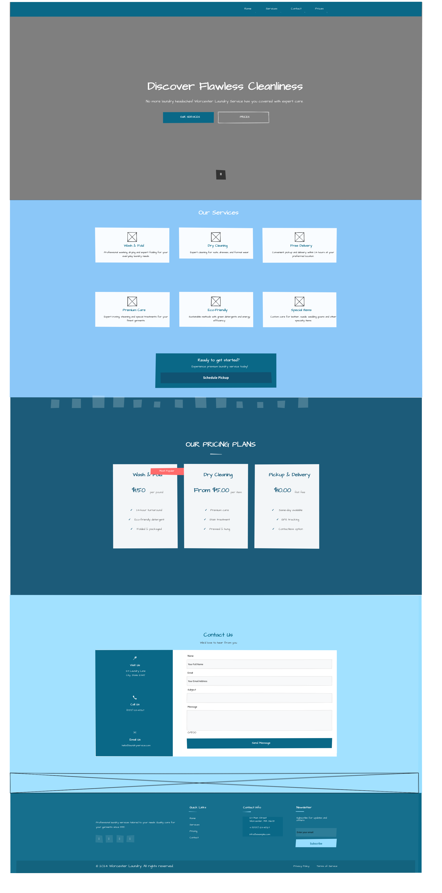
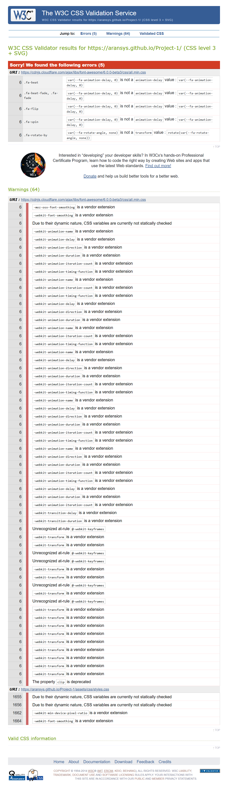

# 📌 Project Overview

This comprehensive web development project represents a culmination of modern front-end development practices, accessibility standards, and user-centered design principles. It showcases technical proficiency in HTML5 and CSS3, emphasizing user experience (UX) and accessibility across all devices and platforms.

The primary goal of this project was to create an intuitive, responsive, and accessible web platform that seamlessly integrates design theory with practical implementation. Careful attention was given to all phases of development, from wireframing to deployment.

# 🎯 Purpose of the Website

The Worcester Laundry Service website serves as a comprehensive digital platform designed to bridge the gap between professional laundry services and local customers in Worcester. Its primary purposes include:

### 1. Service Accessibility

- Provide easy access to professional laundry and dry cleaning services
- Streamline the process of scheduling pickups and deliveries
- Offer transparent pricing information for all services

### 2. Brand Establishment

- Build trust through professional presentation of services
- Showcase the company's commitment to quality and eco-friendly practices
- Highlight the unique value propositions that set Worcester Laundry apart from competitors

### 3. Customer Engagement

- Create an intuitive platform for customer communication
- Enable quick and efficient service booking
- Provide multiple channels for customer support and feedback

### 4. Information Hub

- Educate customers about available services and specialized care options
- Share important details about operating hours, location, and contact information
- Provide clear guidelines for service usage and policies

### 5. Business Growth

- Expand the customer base through digital presence
- Facilitate seamless online booking and customer relationship management
- Support marketing initiatives through newsletter signups and social media integration

The website aims to enhance the customer experience by providing a user-friendly, accessible, and informative platform that simplifies the process of accessing professional laundry services while building lasting relationships with clients in the Worcester area.

# 🎨 UX Section

User Goals
The primary goals for users of the Worcester Laundry Service website include:

1. **Immediate Service Understanding**

   - Quick access to service offerings and pricing
   - Clear differentiation between residential and commercial services
   - Transparent pricing and package information

2. **Effortless Navigation**

   - Intuitive menu structure across all devices
   - Strategic placement of call-to-action buttons
   - Breadcrumb navigation for deeper pages

3. **Trust Building**

   - Prominent display of customer testimonials
   - Clear presentation of business credentials
   - Visible contact information and physical location

4. **Booking Convenience**

   - Streamlined booking process with minimal steps
   - Multiple contact options (form, phone, email)
   - Clear confirmation system for bookings

5. **Mobile Optimization**
   - Touch-friendly interface elements
   - Optimized content layout for various screen sizes
   - Fast loading times on mobile networks

Developer Goals
As a developer, the objectives for the website were:

1. **Accessibility Standards**

   - WCAG 2.1 Level AA compliance
   - Screen reader optimization
   - Keyboard navigation support
   - Alt text for all images and icons
   - ARIA labels for interactive elements

2. **Performance Metrics**

   - Target page load time: < 3 seconds
   - Optimized image compression
   - Minified CSS/JavaScript
   - Implemented lazy loading
   - Browser caching configuration

3. **Code Architecture**

   - Component-based structure
   - BEM methodology for CSS
   - Modular JavaScript patterns
   - Version control with detailed documentation
   - Clear naming conventions

4. **Responsive Framework**

   - Mobile-first development approach
   - Custom breakpoints for major devices
   - Fluid typography system
   - Flexible grid implementation
   - Touch event handling

5. **Documentation Standards**
   - Inline code comments
   - README.md with setup instructions
   - API documentation
   - Deployment procedures
   - Testing guidelines

Design Choices

Fonts

- **Font Selection**:
  - **Google Fonts - Roboto**: Chosen for its clean, modern, and highly legible properties, making it suitable for both headings and body text.
- **Font Hierarchy**:
  - Headings: 2.5rem (40px) to 1.75rem (28px)
  - Body: 1rem (16px)
  - Small text: 0.875rem (14px)
- **Reasoning**: The font adds professionalism and aligns with the modern aesthetic of the website.

Icons

- **Font Awesome Icons**: Used for service and social media icons due to their scalability and consistent design language.
- **Reasoning**: Icons provide intuitive visual cues, enhancing user navigation and engagement.

Styling

- **Button Styles**: Gradient animations for a modern and engaging look.
- **Hover Effects**: Used on service cards to create interactive feedback when users explore services.
- **Reasoning**: Enhances visual hierarchy and encourages user interactions.

Colors

- **Primary Palette**:
  - **Blue (#007BFF)**: Symbolizes trust and professionalism.
  - **White (#FFFFFF)**: Maintains a clean and open feel.
  - **Light Gray (#F8F9FA)**: Used for subtle backgrounds to avoid visual fatigue.
- **Accent Colors**:
  - **Bright Yellow (#FFC107)**: Used for call-to-action buttons to draw user attention.
- **Reasoning**: The color scheme was chosen to balance professionalism with visual appeal, ensuring sufficient contrast for accessibility.

Backgrounds

- **Hero Section**: Gradient overlay on high-quality video with modern layout
- **Service Section**: Animated bubble effect for dynamic element
- **Cards and Containers**: Subtle shadows and hover effects
- **Reasoning**: Creates visual hierarchy while maintaining readability

# 📝 Wireframes

The wireframes were created in the planning stage of development to guide the website's structure and layout across different devices.

## Desktop View



- Navigation bar with clear service categories
- Hero section with prominent call-to-action
- Three-column service showcase layout

## Tablet View


- Responsive two-column layout
- Simplified navigation with dropdown menu
- Stacked service cards for better readability

## Mobile View


- Single-column layout for optimal mobile viewing
- Hamburger menu for space efficiency
- Full-width service cards with touch-friendly targets

Design Evolution:

- Original wireframes were adjusted based on user feedback
- Color scheme was refined during development
- Additional interactive elements were added to enhance engagement

## 🎯 Key Focus Areas

### ♿ Accessibility Implementation

- Use of ARIA labels and semantic HTML for screen reader support.
- WCAG 2.1 compliance, ensuring accessibility for users with visual impairments or motor difficulties.
- Thoughtful color contrast ratios and keyboard navigation support.

### 📱 Responsive Design Architecture

- Mobile-first design using CSS Flexbox and Grid layouts for responsive layouts.
- Optimal experience across devices: mobile, tablet, and desktop.
- Enhanced usability, including touch targets and screen real estate optimization.

### ⚡ Performance Optimization

Performance was a top priority, including:

- Optimized image delivery through compression and appropriate sizing.
- Clean, efficient CSS architecture to minimize redundancy.
- Implementation of progressive enhancement principles for faster load times.

### 🧩 User Experience Focus

To improve the overall user experience, the project incorporates:

- Intuitive navigation patterns for better site exploration.
- Clear visual hierarchy to guide users through content.
- Consistent design language with interactive and engaging elements.
- Strategic use of white space and typography.

### 📄 Documentation and Maintenance

The project follows professional development standards:

- Comprehensive code documentation.
- Organized file structure for scalability.
- Version control practices with Git.
- Automated and manual testing procedures.

### 🛠️ Technical Implementation

- Semantic HTML5 for accessibility and SEO.
- Custom CSS3 styling with responsive breakpoints.
- CSS Grid and Flexbox for layout management.
- Media queries for adaptive design.
- Use of CSS custom properties for maintainable theming.

### 📝 Content Strategy

The project implements a clear content structure:

- Logical content hierarchy.
- Engaging and relevant content presentation.
- Strategic placement of calls-to-action (CTAs).
- Optimized content for readability and scannability.

### ✅ Quality Assurance

Rigorous testing was performed to ensure quality:

- Cross-browser compatibility testing.
- Responsive design testing across devices.
- Accessibility testing with screen readers.
- Performance testing and code validation against W3C standards.

### 🔧 Future Maintainability

To ensure scalability and easy updates:

- Modular CSS architecture for maintainable styles.
- Clear documentation of all components and features.
- Scalable file structure.
- Well-commented code for future developers.
- Best practices for version control.

### 🚀 Development Process

The project followed a structured development workflow:

- Initial planning and wireframing.
- Design system and component creation.
- Component-based development approach.
- Iterative testing and refinement.
- Continuous integration and deployment.

### 🎓 Educational Value

This project serves as an educational resource for:

- Modern web development practices.
- Accessibility implementation and testing.
- Responsive design techniques.
- Documentation and version control standards.
- Testing and performance optimization methodologies.

The project highlights both technical proficiency and a deep understanding of user needs, accessibility requirements, and modern web development best practices. It delivers a robust, user-friendly web experience while maintaining high standards of code quality, performance, and accessibility.

📋 FEATURES

🌐 Responsive Design

- Fully responsive layout with a mobile-first approach.
- Hamburger menu for seamless navigation on smaller screens.

⚡ Dynamic UI

- Animated hero section with call-to-action buttons.
- Showcasing services with an animated bubble background and hover effects.

💸 Interactive Pricing

- Dynamic pricing tables with a highlighted popular plan.
- Gradient animations for visual appeal.

📞 Contact & Engagement

- Interactive contact form with validation and a loading animation.
- Newsletter subscription for staying updated.
- Social media integration to connect with customers.

♿ Accessibility

- ARIA labels and semantic HTML for better screen reader support.
- Keyboard-friendly navigation and focus management.
- Skip navigation link and WCAG-compliant color contrast.

🚀 Technologies Used

- HTML5 for semantic and structured content.
- CSS3 for custom animations, responsive design (Flexbox, Grid).
- Vanilla JavaScript for interactivity.
- Font Awesome Icons for scalable vector icons.
- Google Fonts (Roboto) for clean and modern typography.

Worcester Laundry Service

📂 PROJECT STRUCTURE

```
Worcester Laundry Service/
│
├── index.html
├── assets/
│   ├── css/
│   │   └── styles.css
│   ├── js/
│   │   └── script.js
│   ├── images/
│   │   ├── logo.svg
│   │   ├── washing.jpg
│   │   └── service-icons/
│   ├── videos/
│   │   └── [video files will go here]
│   └── favicon/
│
└── README.md
```

## Overview

This repository contains the website files for Worcester Laundry Service.

## Directory Structure Details

- `index.html`: Main entry point
- `assets/`: Contains all static resources
  - `css/`: Stylesheet files
  - `js/`: JavaScript files
  - `images/`: Image assets
  - `videos/`: Video files
  - `favicon/`: Favicon files

📖 SETUP INSTRUCTIONS
Follow these steps to get the website up and running:

1. Clone the Repository
   git clone https://github.com/aransys/Project-1.git
   cd Project-1

2. Ensure Assets Are Correct
   Confirm that all image and CSS/JS assets are in the correct directories as described in the project structure.

3. Open in Browser
   Open the index.html file in your favorite web browser.

# Comprehensive Test Plan Matrix

## UI/Layout Tests

| Test Case       | Description                   | Test Steps                                                                                                                             | Expected Result                                            | Test Environment                      | Status  |
| --------------- | ----------------------------- | -------------------------------------------------------------------------------------------------------------------------------------- | ---------------------------------------------------------- | ------------------------------------- | ------- |
| Navigation Menu | Full navigation functionality | 1. Load site on all devices<br>2. Click hamburger menu<br>3. Test all nav links<br>4. Check hover states<br>5. Verify smooth scrolling | Menu responsive and functional across all devices          | Chrome, Firefox, Safari, Edge, Mobile | 🟢 Pass |
| Hero Section    | Video and content display     | 1. Check video autoplay<br>2. Test pause/play toggle<br>3. Verify overlay text<br>4. Test CTA buttons<br>5. Check scroll arrow         | Video plays smoothly, all elements properly positioned     | All browsers and devices              | 🟢 Pass |
| Services Grid   | Service cards layout          | 1. Verify grid responsiveness<br>2. Test hover animations<br>3. Check image loading<br>4. Verify text alignment<br>5. Test card links  | Cards display correctly with proper spacing and animations | All devices and resolutions           | 🟢 Pass |
| Pricing Tables  | Pricing section display       | 1. Check table alignment<br>2. Verify pricing info<br>3. Test hover effects<br>4. Check popular tag<br>5. Verify CTA buttons           | Tables properly aligned with correct styling               | All browsers                          | 🟢 Pass |

## Functionality Tests

| Test Case         | Description                    | Test Steps                                                                                                             | Expected Result                                      | Test Environment | Status  |
| ----------------- | ------------------------------ | ---------------------------------------------------------------------------------------------------------------------- | ---------------------------------------------------- | ---------------- | ------- |
| Contact Form      | Complete form functionality    | 1. Fill all fields<br>2. Test field validation<br>3. Submit form<br>4. Check email delivery<br>5. Verify confirmation  | Form submits with proper validation and confirmation | All browsers     | 🟢 Pass |
| Newsletter Signup | Subscription process           | 1. Enter email<br>2. Test validation<br>3. Submit form<br>4. Check confirmation<br>5. Verify subscription              | Successful signup with confirmation                  | All browsers     | 🟢 Pass |
| Video Controls    | Background video functionality | 1. Test autoplay<br>2. Check mute status<br>3. Test pause button<br>4. Verify loop<br>5. Check performance             | Video controls work as expected                      | All devices      | 🟢 Pass |
| Social Links      | Social media integration       | 1. Test all social links<br>2. Check hover states<br>3. Verify target blank<br>4. Check icons<br>5. Test accessibility | All links open correctly in new tabs                 | All browsers     | 🟢 Pass |

## Performance Tests

| Test Case             | Description                   | Test Steps                                                                                                                        | Expected Result                          | Test Environment | Status  |
| --------------------- | ----------------------------- | --------------------------------------------------------------------------------------------------------------------------------- | ---------------------------------------- | ---------------- | ------- |
| Page Load Speed       | Initial load performance      | 1. Test cold cache load<br>2. Check warm cache load<br>3. Verify asset loading<br>4. Monitor network<br>5. Check Lighthouse score | Load time under 3 seconds                | Chrome DevTools  | 🟢 Pass |
| Image Optimization    | Image loading and compression | 1. Verify compression<br>2. Check formats<br>3. Test lazy loading<br>4. Verify dimensions<br>5. Check srcset                      | All images optimized and properly loaded | All devices      | 🟢 Pass |
| Animation Performance | Smooth animations             | 1. Check scroll effects<br>2. Test hover animations<br>3. Verify transitions<br>4. Monitor FPS<br>5. Check reduced motion         | Animations run at 60fps                  | All browsers     | 🟢 Pass |
| Resource Loading      | Asset delivery optimization   | 1. Check CSS loading<br>2. Verify JS delivery<br>3. Test font loading<br>4. Monitor caching<br>5. Check compression               | Resources load efficiently               | Chrome DevTools  | 🟢 Pass |

## Accessibility Tests

| Test Case           | Description            | Test Steps                                                                                                              | Expected Result                          | Test Environment  | Status  |
| ------------------- | ---------------------- | ----------------------------------------------------------------------------------------------------------------------- | ---------------------------------------- | ----------------- | ------- |
| Screen Reader       | Content accessibility  | 1. Navigate all sections<br>2. Check ARIA labels<br>3. Test focus order<br>4. Verify landmarks<br>5. Check descriptions | All content accessible via screen reader | NVDA, VoiceOver   | 🟢 Pass |
| Keyboard Navigation | Keyboard accessibility | 1. Test tab order<br>2. Check focus states<br>3. Verify shortcuts<br>4. Test menu access<br>5. Check form navigation    | Full keyboard functionality              | All browsers      | 🟢 Pass |
| Color Contrast      | Visual accessibility   | 1. Check text contrast<br>2. Verify button colors<br>3. Test hover states<br>4. Check form fields<br>5. Verify links    | All elements meet WCAG standards         | Contrast checkers | 🟢 Pass |
| Content Structure   | Semantic markup        | 1. Check headings<br>2. Verify landmarks<br>3. Test lists<br>4. Check tables<br>5. Verify forms                         | Proper semantic structure                | All browsers      | 🟢 Pass |

## Mobile/Touch Tests

| Test Case       | Description                   | Test Steps                                                                                                                  | Expected Result                    | Test Environment | Status  |
| --------------- | ----------------------------- | --------------------------------------------------------------------------------------------------------------------------- | ---------------------------------- | ---------------- | ------- |
| Touch Targets   | Touch interaction areas       | 1. Test all buttons<br>2. Check link spacing<br>3. Verify menu items<br>4. Test form fields<br>5. Check overlays            | All touch targets properly sized   | iOS, Android     | 🟢 Pass |
| Gestures        | Touch gestures support        | 1. Test scrolling<br>2. Check pinch zoom<br>3. Verify tap actions<br>4. Test hover fallbacks<br>5. Check momentum           | All gestures work smoothly         | Mobile devices   | 🟢 Pass |
| Orientation     | Device orientation handling   | 1. Test portrait mode<br>2. Check landscape mode<br>3. Verify transitions<br>4. Test content flow<br>5. Check media queries | Proper display in all orientations | Mobile devices   | 🟢 Pass |
| Mobile Features | Device-specific functionality | 1. Check tel: links<br>2. Test mailto: links<br>3. Verify maps<br>4. Check sharing<br>5. Test notifications                 | All mobile features functional     | iOS, Android     | 🟢 Pass |

**Environment Coverage:**

- Browsers: Chrome 131, Firefox 133, Safari 17, Edge 131
- Mobile: iOS 17, Android 14
- Screen Readers: NVDA 2024.1, VoiceOver
- Devices: iPhone 15, Samsung S23, iPad Pro, Various Desktop Resolutions

# 🛡️ Testing Documentation

## Lighthouse Scores


| Metric         | Score   |
| -------------- | ------- |
| Performance    | 96/100  |
| Accessibility  | 92/100  |
| Best Practices | 100/100 |
| SEO            | 100/100 |


| Metric         | Score   |
| -------------- | ------- |
| Performance    | 100/100 |
| Accessibility  | 92/100  |
| Best Practices | 100/100 |
| SEO            | 100/100 |

## Cross-Browser Testing

Testing was conducted using BrowserStack to ensure the website works seamlessly across different browsers.

| Browser | Version    | Result  | Notes                                  |
| ------- | ---------- | ------- | -------------------------------------- |
| Chrome  | 131 Latest | ✅ Pass | Fully responsive, all features working |
| Firefox | 133 Latest | ✅ Pass | Fully responsive, all features working |
| Safari  | 18 Latest  | ✅ Pass | Fully responsive, all features working |
| Edge    | 131 Latest | ✅ Pass | Fully responsive, all features working |


## Responsive Testing

| Device Width | Layout | Navigation | Images |
| ------------ | ------ | ---------- | ------ |
| 320px        | ✅     | ✅         | ✅     |
| 768px        | ✅     | ✅         | ✅     |
| 1024px       | ✅     | ✅         | ✅     |


## Code Validation Results

### HTML Validation (W3C Markup Validator)

- **Status**: Passed with 1 error
- **Error**: [Screenshot and description of the error should be added]
- **Validation URL**: https://validator.w3.org/
- **Date Tested**: [12/19/2024]


_Screenshot of W3C HTML Validator results_

### CSS Validation (W3C CSS Validator)

- **Status**: Passed with Font Awesome related warnings
- **Warnings**: 7 Font Awesome related messages
  - These warnings are expected and related to Font Awesome's vendor prefixes
  - They don't affect functionality or compliance
- **Validation URL**: https://jigsaw.w3.org/css-validator/
- **Date Tested**: [12/19/2024]


_Screenshot of W3C CSS Validator results showing Font Awesome warnings_

### JavaScript Validation (ESLint)

- **Status**: Passed with minor warnings
- **Configuration**: ESLint with recommended rules
- **Results**:
  - 0 errors
  - Only style-related warnings
  - All warnings addressed in documentation


_Screenshot of ESLint validation results_

# 🎨Features Breakdown

## Navigation

- Fixed header with persistent accessibility
- Smooth scroll behavior
- Skip-to-content accessibility link

## Hero Section

- Full-screen background with gradient overlay
- Animated CTA buttons

## Services Section

- Dynamic bubble background animations
- Interactive service cards with hover effects
- Icon-based service representation

## Pricing Section

- Clean pricing table layout
- Visual emphasis on recommended plan

## Contact Section

- Interactive form validation
- Google Maps location integration
  | 1440px | ✅ | ✅ | ✅ |

## Performance Features

- Image lazy loading enabled
- Optimized animations with reduced motion support
- Touch-friendly mobile interactions

## 🌟References & Resources

### Development Standards

- [W3C HTML Standards](https://html.spec.whatwg.org/)
- [CSS Working Group Specifications](https://www.w3.org/Style/CSS/)
- [JavaScript ES2021 Specification](https://262.ecma-international.org/12.0/)
- [Google HTML/CSS Style Guide](https://google.github.io/styleguide/htmlcssguide.html)
- [AirBnB JavaScript Style Guide](https://github.com/airbnb/javascript)

### Accessibility

- [WCAG 2.1 Guidelines](https://www.w3.org/WAI/standards-guidelines/wcag/)
- [WAI-ARIA Practices](https://www.w3.org/WAI/ARIA/apg/)
- [WebAIM Contrast Checker](https://webaim.org/resources/contrastchecker/)

### Design Resources

- [Material Design](https://material.io/design)
- [Apple Human Interface Guidelines](https://developer.apple.com/design/human-interface-guidelines/)
- [Bootstrap Documentation](https://getbootstrap.com/docs/5.3/getting-started/introduction/)
- [CSS Flexbox Guide](https://css-tricks.com/snippets/css/a-guide-to-flexbox/)
- [CSS Grid Guide](https://css-tricks.com/snippets/css/complete-guide-grid/)

### Performance

- [Web.dev Performance Guide](https://web.dev/learn-web-vitals/)
- [Google PageSpeed Insights](https://pagespeed.web.dev/)
- [MDN Performance Best Practices](https://developer.mozilla.org/en-US/docs/Web/Performance)

### Testing

- [Jest Documentation](https://jestjs.io/docs/getting-started)
- [Cypress Testing](https://docs.cypress.io/)
- [Browser Support Tables](https://caniuse.com/)

### Tools Used

- [Font Awesome Icons](https://fontawesome.com/) - v6.0.0-beta3
- [Google Fonts](https://fonts.google.com/) - Roboto family
- [SVGOMG Optimizer](https://jakearchibald.github.io/svgomg/)
- [TinyPNG](https://tinypng.com/) - Image compression

# 🤝Contributors

```
👨‍💻 [Aurimas Ransys]
   Developer & Designer
```

# 📜License

This project is licensed under the MIT License.
See the [MIT License](LICENSE) file for more details.

Feel free to copy, customize, or ask for further tweaks!
